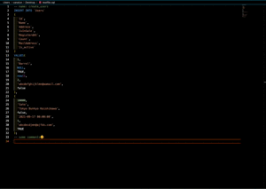

# vSQLfmt

Hi, friends! This is a vscode extension for formatting SQL files🥳

## Current Features 🎉

✅ format 'INSERT' queries like a table! 

## How To Use 💻
Very EASY.

1. Install it
2. Open Command Palette(OSX: `Shift` + `Cmd` + `P`; Windows: `Shift` + `Ctrl` + `P`)
3. Run `Format INSERT Queries`

## Known Issues 👾

We're gonna add many nice features!
Please look forward to them😊

We also know many issues like the below remain, and we're gonna fix them!
- comments embedded in queries are not correctly parsed and replaced
- some varchar values are not correctly parsed

## Release Notes 📓

### 1.0.0

- HBD🎂
- vSQLfmt gets able to format 'INSERT' queries!

## Contribution 🌟
- Let's be creative and collaborative👶
- Please read [CONTRIBUTING.md](https://github.com/canalun/vsqlfmt/blob/main/CONTRIBUTING.md) for the details😉
